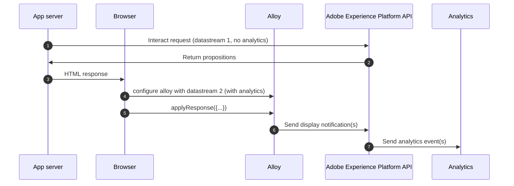

# Strategy for Analytics

When Analytics is configured for a [Datastream](https://experienceleague.adobe.com/docs/experience-platform/edge/datastreams/overview.html?lang=en), events are automatically forwarded so that hits are captured.  Special attention must be paid when implementing hybrid mode so that hits are not counted twice.

The strategy employed by these samples utilizes two different datastreams.  One with analytics configured, and one without.  The datastream _**without**_ analytics configured is used for edge requests sent server-side.  And the datastream _**with**_ analytics configured is used for alloy on the client-side.  That way the server-side request does not register any analytics events, but the client side does.  The result is analytics are accurately counted only once.

### Flow Diagram

| Datastream   | Analytics configured |
|--------------|----------------------|
| Datastream 1 | No                   |
| Datastream 2 | Yes                  |

