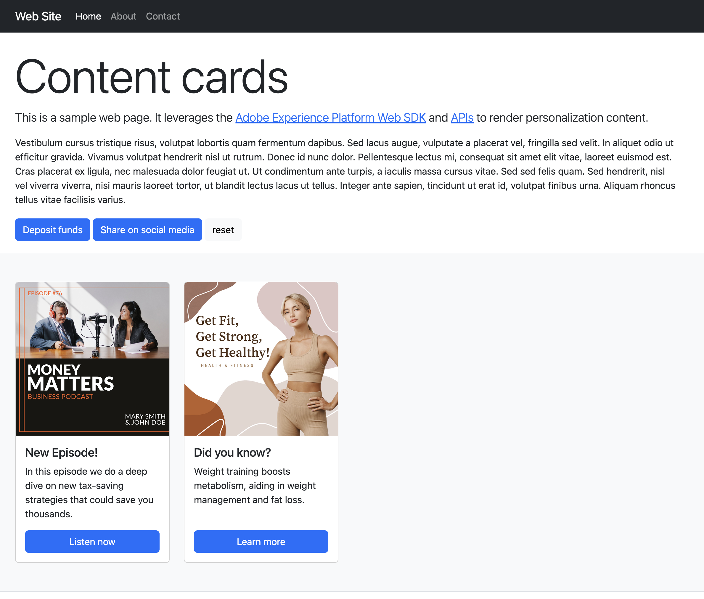
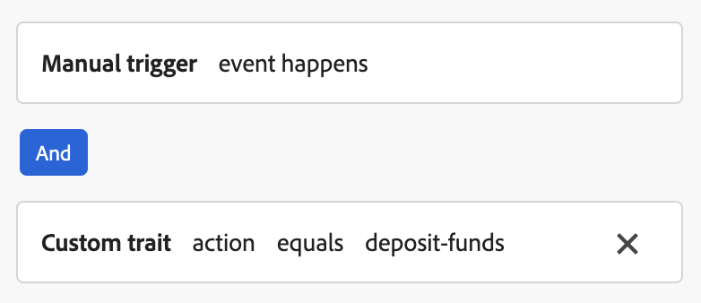
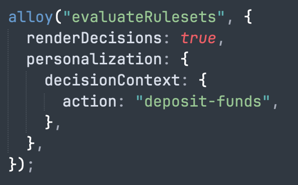
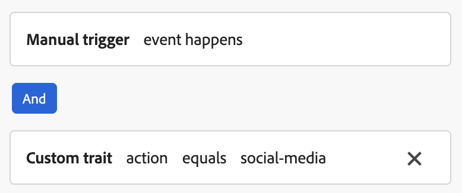
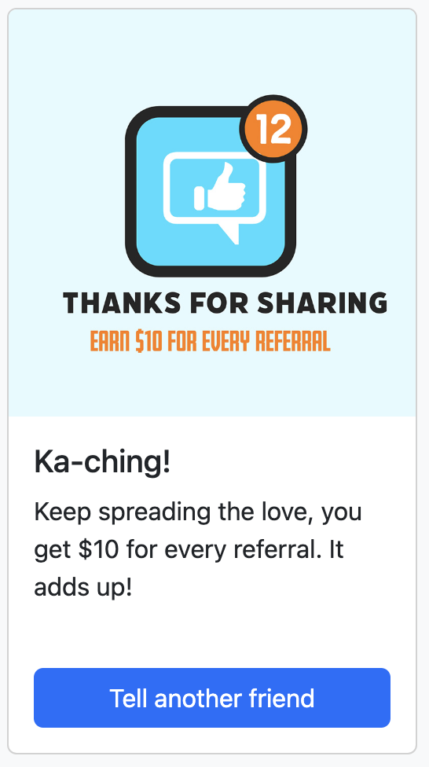
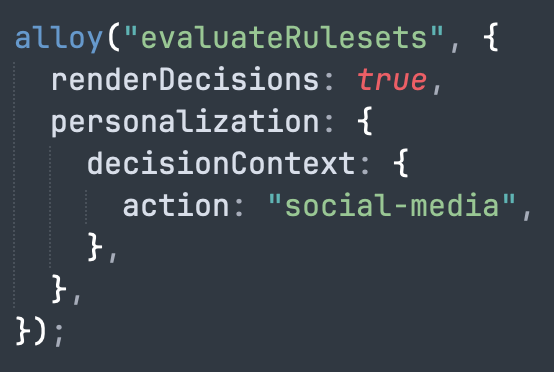

# Content Cards

## Overview

This sample demonstrates using Adobe Experience Platform to get Content Cards from Adobe Journey Optimizer (AJO). It uses the [Adobe Experience Platform Web SDK](https://experienceleague.adobe.com/docs/experience-platform/edge/home.html) to get personalization content and to render it entirely client-side.

Here is what the page looks like on first page load.



If you click the "Deposit Funds" and "Share on social media" buttons, additional content cards will be shown.  This is because those cards utilize client side triggers so that they show only when certain conditions are met.

## Running the sample

<small>Prerequisite: [install node and npm](https://docs.npmjs.com/downloading-and-installing-node-js-and-npm).</small>

To run this sample:

1. [Setup local SSL certificates for https](../../LocalSSLCertificateSetup.md).
2. Clone the repository to your local machine.
3. Open a terminal and change directory to this sample's folder.
4. Run `npm install`
5. Run `npm start`
6. Open a web browser to [https://localhost](https://localhost)

## How it works

1. [Web SDK](https://experienceleague.adobe.com/docs/experience-platform/edge/home.html) is included and configured on the page. The configuration is based on the `.env` file within the sample folder.

```javascript
<script src="https://cdn1.adoberesources.net/alloy/2.18.0/alloy.min.js" async></script>
alloy("configure", {
  defaultConsent: "in",
  edgeDomain: "{{edgeDomain}}",
  edgeConfigId: "{{edgeConfigId}}",
  orgId:"{{orgId}}",
  debugEnabled: false,
  personalizationStorageEnabled: true,
  thirdPartyCookiesEnabled: false
});
```

2. The `sendEvent` command is used to fetch personalization content.

```javascript
alloy("sendEvent", {
  renderDecisions: true,
  personalization: {
    surfaces: ["web://alloy-samples.adobe.com/#content-cards-sample"],
  },
});
```

3. The `subscribeRulesetItems` command is used to subscribe to content cards for a surface.  Any time the rulesets are evaluated, the callback provided to this command receives a result object with `propositions` that hold the content card data.

```javascript
const contentCardManager = createContentCardManager("content-cards");

alloy("subscribeRulesetItems", {
  surfaces: ["web://alloy-samples.adobe.com/#content-cards-sample"],
  schemas: ["https://ns.adobe.com/personalization/message/content-card"],
  callback: (result, collectEvent) => {
    const { propositions = [] } = result;
    contentCardManager.refresh(propositions, collectEvent);
  },
});
```

4. The `contentCardsManager` object is unique to this sample (found in `script.js`).  It's in charge of rendering content cards and sending `interact` and `display` events for them.  When it receives propositions from the callback method, it extracts content cards from them and sorts them.

```javascript
  const createContentCard = (proposition, item) => {
    const { data = {}, id } = item;
    const {
      content = {},
      meta = {},
      publishedDate,
      qualifiedDate,
      displayedDate,
    } = data;

    return {
      id,
      ...content,
      meta,
      qualifiedDate,
      displayedDate,
      publishedDate,
      getProposition: () => proposition,
    };
  };

  const extractContentCards = (propositions) =>
    propositions
      .reduce((allItems, proposition) => {
        const { items = [] } = proposition;

        return [
          ...allItems,
          ...items.map((item) => createContentCard(proposition, item)),
        ];
      }, [])
      .sort(
        (a, b) =>
          b.qualifiedDate - a.qualifiedDate || b.publishedDate - a.publishedDate
      );

const contentCards = extractContentCards(propositions);
```

5. Next, content cards are rendered based on the content card details defined for each campaign.  Each card includes a `title`, `body`, `imageUrl`, and other custom data values.  

```javascript
const renderContentCards = () => {
  const contentCardsContainer = document.getElementById(containerElementId);
  contentCardsContainer.addEventListener("click", handleContentCardClick);

  let contents = "";

  contentCards.forEach((card) => {
    const { id, title, body, imageUrl, meta = {} } = card;
    const { buttonLabel = "" } = meta;

    contents += `
        <div class="col">
          <div data-id="${id}" class="card h-100">
            
            <div class="card-body d-flex flex-column">
              <h5 class="card-title">${title}</h5>
              <p class="card-text">${body}</p>
              <a href="#" class="mt-auto btn btn-primary">${buttonLabel}</a>
            </div>
          </div>
        </div>
      `;
  });

  contentCardsContainer.innerHTML = contents;
  collectEvent(
    "display",
    contentCards.map((card) => card.getProposition())
  );
};

```

6. When the `subscribeRulesetItems` callback is invoked, in addition to personalization results, a convenience function called `collectEvent` is provided that can be used to send experience edge events to track interactions, displays and other events.  This function is used in this sample to track any time a content card is clicked.  And if the button on the content card is clicked, the browser is directed to the `actionUrl` specified by the campaign.

```javascript
const handleContentCardClick = (evt) => {
  const cardEl = evt.target.closest(".card");

  if (!cardEl) {
    return;
  }

  const isAnchor = evt.target.nodeName === "A";
  const card = contentCards.find((card) => card.id === cardEl.dataset.id);

  if (!card) {
    return;
  }

  collectEvent("interact", [card.getProposition()]);

  if (isAnchor) {
    evt.preventDefault();
    evt.stopImmediatePropagation();
    const { actionUrl } = card;
    if (actionUrl && actionUrl.length > 0) {
      window.location.href = actionUrl;
    }
  }
};

```


## Key Observations

### personalizationStorageEnabled

The `personalizationStorageEnabled` configuration option is set to `true` in the `configure` command.  This is  important so that content cards that were previously qualified for will continue to be displayed.

### Triggers

Content cards support custom triggers that are evaluated client side.  When a trigger rule is satisfied additional content cards will be shown.  There are 4 different campaigns used in this sample.  One campaign for each content card.  Each one uses the same surface: `web://alloy-samples.adobe.com/#content-cards-sample`.  In the table below you can view the trigger rules for each and how to satisfy them.

| Trigger rule                                                 | Card                                                         | How to satisfy the trigger rule                              |
| ------------------------------------------------------------ | ------------------------------------------------------------ | ------------------------------------------------------------ |
| None                                                         |  | sendEvent command.  No client side rule to satisfy.          |
| None                                                         |  | sendEvent command.  No client side rule to satisfy.          |
|  |  |  |
|  |  |  |

The `evaluateRulesets` command is invoked when clicking the "Deposit Funds" and "Share on social media" buttons.  Each one specifying the appropriate `decisionContext` to satisfy the rule defined for each campaign.

```javascript
document.getElementById("action-button-1").addEventListener("click", () => {
  alloy("evaluateRulesets", {
    renderDecisions: true,
    personalization: {
      decisionContext: {
        action: "deposit-funds",
      },
    },
  });
});

document.getElementById("action-button-2").addEventListener("click", () => {
  alloy("evaluateRulesets", {
    renderDecisions: true,
    personalization: {
      decisionContext: {
        action: "social-media",
      },
    },
  });
});

```

## Beyond the sample

This sample app can serve as a starting point for you to experiment and learn more about Adobe Experience Platform. For example, you can change a few environment variables so the sample app pulls in content from your own AEP configuration. To do so, just open the `.env` file within the sample folder and modify the variables. Restart the sample app, and you're ready to experiment using your own personalization content.
