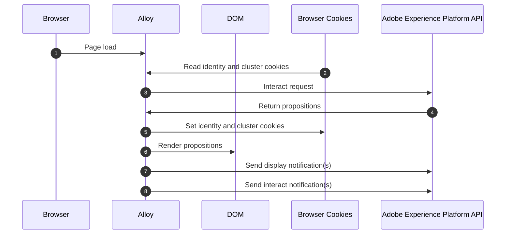

# Content Cards

## Overview

This sample demonstrates using Adobe Experience Platform to get personalization content from Adobe Journey Optimizer. The web page changes based on the personalization content returned.

This sample uses the [Adobe Experience Platform Web SDK](https://experienceleague.adobe.com/docs/experience-platform/edge/home.html) to get personalization content and to render it entirely client-side.

Here is what the page looks like before and after personalization content is rendered.

| without personalization                                        | with personalization                                                 |
| -------------------------------------------------------------- | -------------------------------------------------------------------- |
|  |  |

Please review the [summary of personalization content](../AJOCampaigns.md) for this sample.

Keep in mind that personalization content can come from any Adobe source such as [Journey Optimizer](https://experienceleague.adobe.com/docs/journey-optimizer/using/ajo-home.html?lang=en) or [Target](https://experienceleague.adobe.com/docs/target.html). Adobe Journey Optimizer is the source of personalization content used in this sample, but the implementation described here will work for all personalization solutions Adobe offers.

## Running the sample

<small>Prerequisite: [install node and npm](https://docs.npmjs.com/downloading-and-installing-node-js-and-npm).</small>

To run this sample:

1. [Setup local SSL certificates for https](../../LocalSSLCertificateSetup.md).
2. Clone the repository to your local machine.
3. Open a terminal and change directory to this sample's folder.
4. Run `npm install`
5. Run `npm start`
6. Open a web browser to [https://localhost](https://localhost)

## How it works

1. [Web SDK](https://experienceleague.adobe.com/docs/experience-platform/edge/home.html) is included and configured on the page. The configuration is based on the `.env` file within the `ajo` folder.

```javascript
<script src="https://cdn1.adoberesources.net/alloy/2.18.0/alloy.min.js" async></script>
alloy("configure", {
  defaultConsent: "in",
  edgeDomain: "{{edgeDomain}}",
  edgeConfigId: "{{edgeConfigId}}",
  orgId:"{{orgId}}",
  debugEnabled: false,
  thirdPartyCookiesEnabled: false
});
```

2. The `sendEvent` command is used to fetch personalization content.

```javascript
alloy("sendEvent", {
  renderDecisions: true,
  personalization: {
    surfaces: ["#sample-json-content"],
  },
}).then(applyPersonalization("#sample-json-content"));
```

3. Web SDK renders page load Visual Experience Composer (VEC) offers automatically because the `renderDecisions` flag is set to true.
4. Code Based JSON experience items are manually applied by the sample implementation code (in the [`applyPersonalization`](public/script.js) method) to update the DOM based on the decision.
5. For code based experience campaigns, display events must manually be sent to indicate when the content has been displayed. This is done via the `sendEvent` command.

```javascript
function sendDisplayEvent(proposition) {
  const { id, scope, scopeDetails = {} } = proposition;

  alloy("sendEvent", {
    xdm: {
      eventType: "decisioning.propositionDisplay",
      _experience: {
        decisioning: {
          propositions: [
            {
              id: id,
              scope: scope,
              scopeDetails: scopeDetails,
            },
          ],
          propositionEventType: {
            display: 1
          },
        },
      },
    },
  });
}
```

6. For code based experience campaigns, interaction events must manually be sent to indicate when a user has interacted with the content. This is done via the `sendEvent` command.

```javascript
function sendInteractEvent(label, proposition) {
  const { id, scope, scopeDetails = {} } = proposition;

  alloy("sendEvent", {
    xdm: {
      eventType: "decisioning.propositionInteract",
      _experience: {
        decisioning: {
          propositions: [
            {
              id: id,
              scope: scope,
              scopeDetails: scopeDetails,
            },
          ],
          propositionEventType: {
            interact: 1
          },
          propositionAction: {
            label: label
          },
        },
      },
    },
  });
}
```

## Key Observations

### Cookies

Cookies are used to persist user identity and cluster information. When using a client-side implementation, the Web SDK handles the storing and sending of these cookies automatically during the request lifecycle.

| Cookie                   | Purpose                                                                    | Stored by | Sent by |
| ------------------------ | -------------------------------------------------------------------------- | --------- | ------- |
| kndctr_AdobeOrg_identity | Contains user identity details                                             | Web SDK   | Web SDK |
| kndctr_AdobeOrg_cluster  | Indicates which experience edge cluster should be used to fulfill requests | Web SDK   | Web SDK |

### Request placement

Requests to Adobe Experience Platform API are required to get propositions, send a display notification and send an interact notification. When using a client-side implementation, the Web SDK makes these requests when the `sendEvent` command is used.

| Request                                        | Made by                             |
|------------------------------------------------| ----------------------------------- |
| interact request to get propositions           | Web SDK using the sendEvent command |
| interact request to send display notifications | Web SDK using the sendEvent command |
| interact request to send click notifications   | Web SDK using the sendEvent command |                          |

### Flow Diagram



Please refer to [Sample Adobe Experience Platform Edge Network Personalization Payloads](../PersonalizationPayloads.md) for examples of the Edge Network API request and responses in the steps 3, 4, 7 and 8 of the flow.

## Beyond the sample

This sample app can serve as a starting point for you to experiment and learn more about Adobe Experience Platform. For example, you can change a few environment variables so the sample app pulls in content from your own AEP configuration. To do so, just open the `.env` file within the `ajo` folder and modify the variables. Restart the sample app, and you're ready to experiment using your own personalization content.
