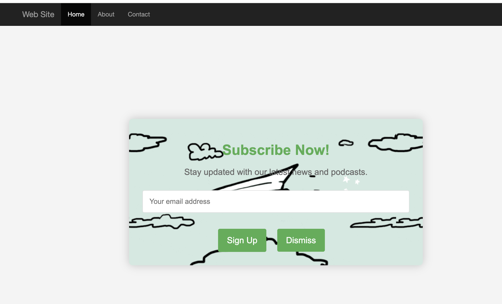

# In-App Messages
Web In-App Messaging is a feature that empowers marketers with the ability to deliver personalized messages to web users. It allows them to display personalized messages on websites using modal-overlay type messages. With this new feature, marketers can effectively engage with web customers, driving user engagement, retention, and conversions.

## Overview

This sample is using [Adobe Experience Platform Web SDK](https://experienceleague.adobe.com/docs/experience-platform/edge/home.html) to display in-app messages.

## Getting Started

1. Author in-app message content in Adobe Journey Optimizer.
2. Configure the sample to use your Adobe Journey Optimizer orgid,  datastreamId and surfaceUrl. Sample configuration is in the .env file.
3. Run the sample.

## Running the sample
Prerequisite: [install node and npm](https://docs.npmjs.com/downloading-and-installing-node-js-and-npm).

To run this sample:
1. [Setup local SSL certificates for https](https://github.com/adobe/alloy-samples/blob/main/LocalSSLCertificateSetup.md)
2. Clone the repository to your local machine.
3. Open a terminal and change directory to this sample's folder.
4. Run `npm install`
5. Run `npm start`
6. Open a web browser to https://localhost

## How it works

There are two ways to display in-app message content from Adobe Journey Optimizer.

[Alloy](https://experienceleague.adobe.com/docs/experience-platform/edge/home.html) is included on the page.
1. On page load the sendEvent command is used to fetch in-app message content.
   example :

```js 
  alloy("sendEvent", {
  renderDecisions: true,
  personalization:{
    surfaces: ['#welcome']
  }
});
```


2. Manually trigger the rulesets evaluation using `evaluateRulesets` command.
   example : 
   
 ```js
  alloy("evaluateRulesets", {
  renderDecisions: true,
   personalization: {
     decisionContext: { 
     "userAction": "buy_now"
     }
   }
});
```

This is how an in-app message looks like:

| on page load with sendEvent                                | manual trigger with  evaluateRulesets                                  |
|-------------------------------------------------------------------|------------------------------------------------------------|
|  |  |


## Key Observations
####  `personalizationStorageEnabled` set to true
In the sample example we want in-app-message on page load to appear only 3 times.
In order to support that we set `personalizationStorageEnabled` to true for the storage of the personalization content in the browser local storage. 
This will allow historical rule evaluation, for example, show the message only once or n number of times.

####  `personalizationStorageEnabled` set to false
in that case message will appear every time.

## Beyond the sample

This sample app can serve as a starting point for you to experiment and learn more about Adobe Experience Platform. For example, you can change a few environment variables so the sample app pulls in content from your own AEP configuration. To do so, just open the `.env` file within the `ajo` folder and modify the variables. Restart the sample app, and you're ready to experiment using your own personalization content.
