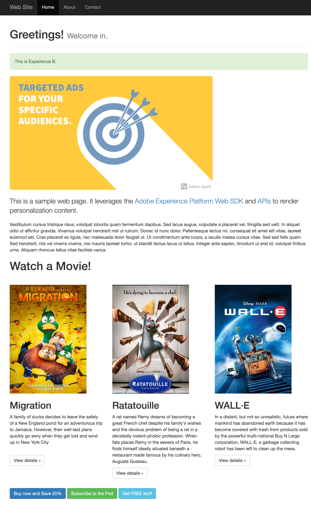

# Automatic Proposition Interaction Tracking

## Overview

This sample builds on top of the [Client-side Personalization sample](../personalization-client-side/README.md), which uses Adobe Experience Platform to get personalization content from Adobe Journey Optimizer.  In addition to the personalized content shown in the other sample, this sample includes a "Watch a Movie!" section that is driven by an AJO code-based campaign which makes use of decision policies.

Here is what the page looks like before and after personalization content is rendered.

| without personalization                                        | with personalization                                                        |
| -------------------------------------------------------------- |-----------------------------------------------------------------------------|
|  |  |

Please review the [summary of personalization content](../AJOCampaigns.md) for this sample.

## Running the sample

<small>Prerequisite: [install node and npm](https://docs.npmjs.com/downloading-and-installing-node-js-and-npm).</small>

To run this sample:

1. [Setup local SSL certificates for https](../../LocalSSLCertificateSetup.md).
2. Clone the repository to your local machine.
3. Open a terminal and change directory to this sample's folder.
4. Run `npm install`
5. Run `npm start`
6. Open a web browser to [https://localhost](https://localhost)

## How it works

1. [Web SDK](https://experienceleague.adobe.com/docs/experience-platform/edge/home.html) is included and configured on the page. The configuration is based on the `.env` file within the `sample` folder.  Automatic proposition interaction tracking is enabled for AJO using the `autoCollectPropositionInteractions` configuration option. 

```javascript
alloy("configure", {
  defaultConsent: "in",
  edgeDomain: "{{edgeDomain}}",
  edgeConfigId: "{{edgeConfigId}}",
  orgId:"{{orgId}}",
  debugEnabled: false,
  thirdPartyCookiesEnabled: false,
  autoCollectPropositionInteractions: {
    AJO: "always",
    TGT: "never"
  }
});
```

2. The `sendEvent` command is used to fetch personalization content.

```javascript
alloy("sendEvent", {
  renderDecisions: true,
  personalization: {
    surfaces: ["web://localhost/#sample-json-content", "web://alloy-samples.adobe.com/#movies-decision-policy"],
  },
}).then(applyPersonalization);
```

3. Web SDK renders page load Visual Experience Composer (VEC) offers automatically because the `renderDecisions` flag is set to true.

4. The [applyPropositions](https://experienceleague.adobe.com/en/docs/experience-platform/web-sdk/commands/applypropositions) command is used to insert the code-based HTML experience for the movies section.

```javascript
const proposition = propositions.find(
  (proposition) =>
    proposition.scope ===
    "web://alloy-samples.adobe.com/#movies-decision-policy"
);

alloy("applyPropositions", {
  propositions: [proposition],
  metadata: {
    ["web://alloy-samples.adobe.com/#movies-decision-policy"]: {
      selector: "p#paragraph-text-2",
      actionType: "insertAfter",
    },
  },
});
```

5. Code-based JSON experience items are manually applied by the sample implementation code to update the DOM based on the proposition.  
The [applyPropositions](https://experienceleague.adobe.com/en/docs/experience-platform/web-sdk/commands/applypropositions) command is used to correlate the code-based JSON experience with elements in the DOM.  This is necessary for code-based JSON experiences where the DOM is updated via custom code.
```javascript
const proposition = propositions.find(
  (proposition) => proposition.scope === "web://localhost/#sample-json-content"
);

alloy("applyPropositions", {
  propositions: [proposition],
  metadata: {
    ["web://localhost/#sample-json-content"]: {
      selector: "#some-buttons",
      actionType: "collectInteractions",
    },
  },
});

alloy("applyPropositions", {
  propositions: [proposition],
  metadata: {
    ["web://localhost/#sample-json-content"]: {
      selector: "img.ajo-decision",
      actionType: "collectInteractions",
    },
  },
});

```
6. When the user clicks anywhere in the DOM where an experience was rendered, an `interact` event is automatically collected.
   

   

## Key Observations


### Proposition interactions are automatically collected

Notice how `interact` events are automatically collected whenever a DOM element on the page is clicked -- if that DOM element is part of an experience that was rendered.


### Data attributes

Data attributes are used add specificity to proposition interactions.

| Name        | Data attribute         | Description                                                  |
| ----------- | ---------------------- | ------------------------------------------------------------ |
| Label       | `data-aep-click-label` | When the label data attribute is present on a clicked element, it is included with the interaction details sent to the Edge Network. The Web SDK looks for a label data attribute beginning with the element clicked and walking up the DOM tree. The Web SDK uses the first label it finds. |
| Token       | `data-aep-click-token` | This token is used when leveraging decision policies in [Adobe Journey Optimizer code-based campaigns](https://experienceleague.adobe.com/en/docs/journey-optimizer/using/code-based-experience/get-started-code-based). You can use the token to distinguish which decision policy item was clicked. When the token data attribute is present on a clicked element, it is included with the interaction details sent to the Edge Network. The Web SDK looks for a token data attribute beginning with the element clicked and walking up the DOM tree. The Web SDK uses the first token it finds. |
| Interact ID | `data-aep-interact-id` | The Web SDK automatically adds this unique ID to container elements when rendering experiences. It uses this ID to correlate DOM elements with propositions. As this is an ID required by the Web SDK, you should not alter it in any way. You can safely ignore it. |

### Decision Policy

A decision policy was used for the code-based campaign that powers the movies section.

#### HTML Template

Here is the HTML template that is used by the code-based campaign.

```html
<h1>Watch a Movie!</h1>
<div class="row movies">
{{#each decisionPolicy.458f2c7a-c43e-4114-8047-b5ce0cba495d.items as |item|}}
  <div class="col-md-4 movie" data-aep-click-token="{{item._experience.decisioning.decisionitem.trackingToken}}">
    
    <h2>{{item._experience.decisioning.decisionitem.itemName}}</h2>
    <p class="description">
      {{item._experience.decisioning.decisionitem.itemDescription}}
    </p>
    <p>
      <button class="btn btn-default" 
              data-aep-click-label="view-movie-{{item._experience.decisioning.decisionitem.itemName}}">
        View details »
      </button>
    </p>
  </div>
{{/each}}
</div>
```

Notice the template iterates across each decision policy item.  Each item, in this case, is a movie within a collection.  That way, the template dynamically renders the list of movies based on the data and policy. Each movie `div` makes use of the `data-aep-click-token` data attribute.  This is a unique identifier given to each decision item that should be used in the template to designate which block of HTML correlates with the decision item.

You'll also notice the `data-aep-click-label` data attribute has been used for the `<button>` element.  This is an easy way to add label-based tracking to elements.  These labels can be used in reporting.

#### Rendered Content

This is what gets rendered to the DOM for the campaign.

```html
<h1 data-aep-interact-id="7">Watch a Movie!</h1>
<div class="row movies" data-aep-interact-id="8">
  <div class="col-md-4 movie" data-aep-click-token="AnRGMUrbCf2Vqfn8fAC7WA">
    
    <h2>WALL·E</h2>
    <p class="description">
      In a distant, but not so unrealistic, future where mankind has abandoned
      earth because it has become covered with trash from products sold by the
      powerful multi-national Buy N Large corporation, WALL-E, a garbage
      collecting robot has been left to clean up the mess.
    </p>
    <p>
      <button class="btn btn-default" data-aep-click-label="view-movie-WALL·E">
        View details »
      </button>
    </p>
  </div>

  <div class="col-md-4 movie" data-aep-click-token="LWMCAzXcp21JzyHYIy/eFQ">
    
    <h2>Ratatouille</h2>
    <p class="description">
      A rat named Remy dreams of becoming a great French chef despite his
      family's wishes and the obvious problem of being a rat in a decidedly
      rodent-phobic profession. When fate places Remy in the sewers of Paris, he
      finds himself ideally situated beneath a restaurant made famous by his
      culinary hero, Auguste Gusteau.
    </p>
    <p>
      <button
        class="btn btn-default"
        data-aep-click-label="view-movie-Ratatouille"
      >
        View details »
      </button>
    </p>
  </div>

  <div class="col-md-4 movie" data-aep-click-token="jHxFAqCNnGEaiT7N4wxbaw">
    
    <h2>Migration</h2>
    <p class="description">
      A family of ducks decides to leave the safety of a New England pond for an
      adventurous trip to Jamaica. However, their well-laid plans quickly go
      awry when they get lost and wind up in New York City
    </p>
    <p>
      <button
        class="btn btn-default"
        data-aep-click-label="view-movie-Migration"
      >
        View details »
      </button>
    </p>
  </div>
</div>

```

The values for movie title, description and image are now populated based on the decision policy and the movies in the collection.  The values for `data-aep-click-token` and `data-aep-click-label` are also populated.

Another observation is that the `data-aep-interact-id` data attribute is present on the two topmost elements.  This data attribute is automatically added to DOM elements by the Web SDK for any experiences automatically rendered to the DOM or experiences rendered to the DOM using the [`applyPropositions`](https://experienceleague.adobe.com/en/docs/experience-platform/web-sdk/commands/applypropositions) command.  You can safely ignore it.

## Beyond the sample

This sample app can serve as a starting point for you to experiment and learn more about Adobe Experience Platform. For example, you can change a few environment variables so the sample app pulls in content from your own AEP configuration. To do so, just open the `.env` file within the `sample` folder and modify the variables. Restart the sample app, and you're ready to experiment using your own personalization content.
