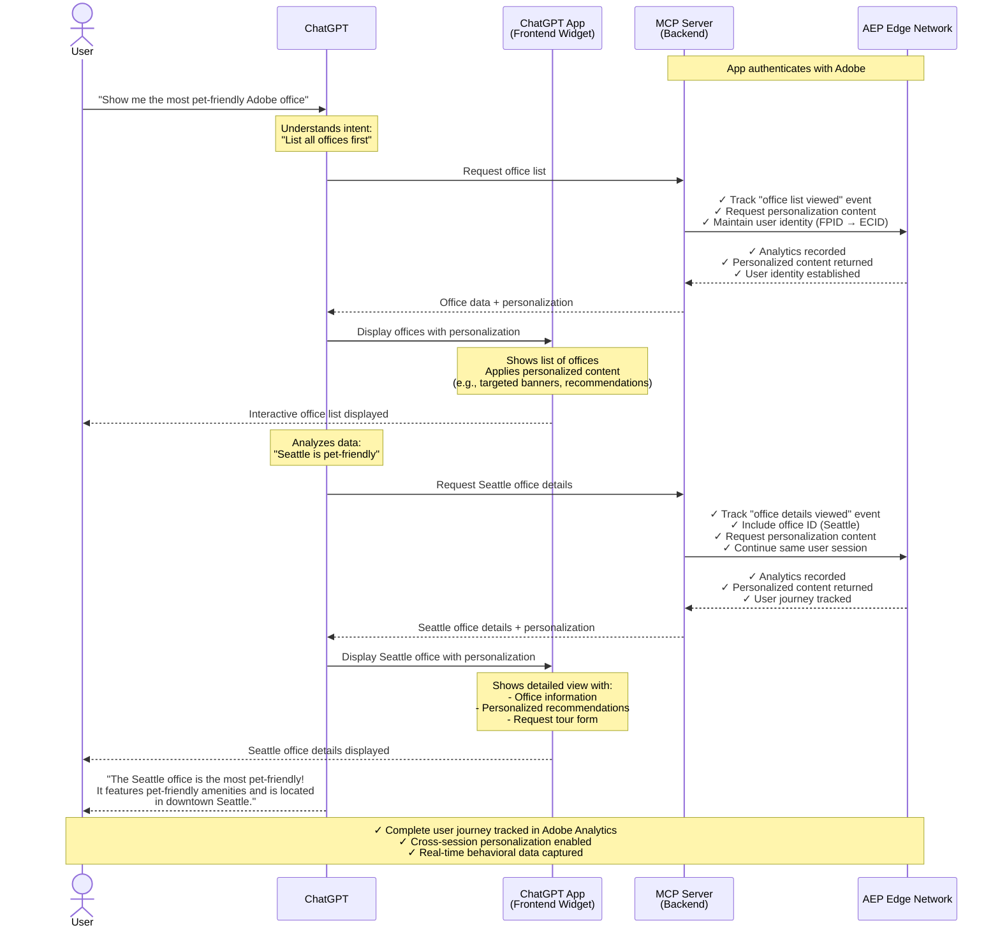
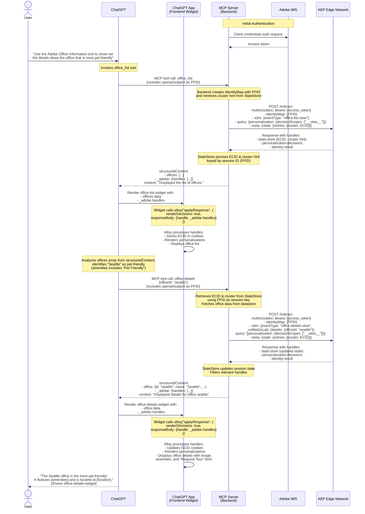

# ChatGPT App + Adobe Experience Platform Edge

This is a reference implementation of a [ChatGPT App](https://developers.openai.com/apps-sdk) that integrates with the Adobe Experience Platform (AEP) Edge Network. It demonstrates a "hybrid" architecture where analytics and personalization logic is shared between a server-side backend and a client-side frontend.

Follow the [Apps SDK quickstart](https://developers.openai.com/apps-sdk/quickstart) to configure your MCP server and widgets, and consult the [design guidelines](https://developers.openai.com/apps-sdk/design/guidelines) to keep the experience native to ChatGPT.

## Package Overview

- **`datastore`**: Contains shared data models (offices) and Zod schemas used by both the backend and frontend to ensure type safety.
- **`experience-edge-client`**: A server-side library that handles authentication with Adobe IMS and communicates directly with the AEP Edge Network. It mimics the capabilities of the client-side Alloy SDK but for server-side environments.
- **`frontend`**: A React application built with Adobe React Spectrum. It renders the UI widgets (like the office list) inside ChatGPT's sandbox and handles the client-side application of personalization decisions, following the [custom UX guidance](https://developers.openai.com/apps-sdk/build/custom-ux).
- **`backend`**: A Node.js application using Hono that serves as the Model Context Protocol (MCP) server (built with the [TypeScript SDK](https://github.com/modelcontextprotocol/typescript-sdk)). It exposes the [Apps SDK tools](https://developers.openai.com/apps-sdk/plan/tools) (`office-list`, `office-details`, `request-visit`) to ChatGPT and orchestrates the connection to Adobe Edge.

## High-level dataflow

## Technical dataflow

## Backend Architecture & Adobe Edge Connection

The `backend` is the core orchestrator of this application. It implements the [Model Context Protocol (MCP)](https://developers.openai.com/apps-sdk/concepts/mcp-server) to provide tools that ChatGPT can invoke.

### Connection to Adobe Edge

The backend connects to the Adobe Edge Network using the `experience-edge-client`. Here is the flow:

1.  **Authentication**: On startup, the backend authenticates with Adobe Identity Management System (IMS) using a Client ID and Secret to obtain an access token.
2.  **Tool Invocation**: When a user asks ChatGPT to "list offices", ChatGPT invokes the `office-list` tool on the backend.
    - The MCP request metadata carries `openai/subject`, which the backend reuses as the First-Party Device ID (FPID) to keep the Adobe session tied to the ChatGPT user identity.
3.  **Server-Side Event**: The backend uses `ExperienceEdgeClient` to send an experience event to AEP Edge.
    - It generates a First-Party Device ID (FPID) based on the OpenAI user subject to maintain session continuity.
    - It sends an XDM (Experience Data Model) payload describing the event (e.g., `office.list.view`).
4.  **Edge Response**: AEP Edge processes the event and returns "handles"—instructions for personalization (e.g., "show this specific banner") or state updates (e.g., "set this cookie").
5.  **Response Passthrough**: The backend packages these handles into the tool response and sends them back to ChatGPT, along with the actual data (the list of offices).

## Hybrid Implementation

This project uses a unique "Hybrid" approach to bridge the gap between the conversational interface (processed on the server) and the visual interface (rendered in the browser).

1.  **Server-Side Collection**: The primary interaction (the "view") is recorded server-side by the backend when the tool is called. This ensures that every interaction is tracked, even if the UI doesn't fully load or if the user is interacting via voice.
2.  **Client-Side Application**: When the frontend widget loads in ChatGPT's browser sandbox:
    - It receives the payload from the backend, including the `_adobe` object containing the state and personalization payloads from AEP Edge.
    - It initializes the client-side Alloy SDK.
    - It calls `alloy("applyResponse", ...)` with the handles received from the server. This will set the relevant `kndctr` cookies (identity and cluster) and apply the personalization payloads to the DOM.

This allows the client-side SDK to "hydrate" its state with the result of the server-side event, effectively merging the server-side session with the client-side browser session. This enables features like consistent personalization and cross-channel state management without requiring two separate network calls to Adobe Edge.

A hybrid implementation is preferred because for a few reasons:

1. The backend mcp server has more information that the frontend app does, such as the `openai/subject`.
2. The MCP specification for backend is more well-defined and is less likely to change-[the proposal for frontend MCP apps was only introduced in November 2025 and has yet to be finalized.](http://blog.modelcontextprotocol.io/posts/2025-11-21-mcp-apps/).
3. A backend allows us to target multiple MCP clients (Claude, Cursor, Gemini, etc) instead of just ChatGPT.

## Development/Usage

1. Install dependencies: `pnpm install`
2. Set up the environment variables: `cp .env.example .env` and fill in the values, including IMS token (for server-to-server auth) and datastream ID. All fields are required.
3. Start dev server in the `chatgpt-app` directory: `pnpm run dev`.
4. Expose the dev server to the public internet. I used [`ngrok`](https://ngrok.com/). `ngrok http 3000`.
5. Log into ChatGPT with at least a "Plus" plan.
6. Open Settings -> Apps & Connectors -> Advanced Settings (bottom of the page) -> Developer Mode.
7. Go back to "Apps & Connectors" -> Create and add the details of the dev server. Use your ngrok URL + "/mcp" as the URL. Select "No Authentication". Fill out the other fields and click "Create".
8. Try out the app in a new chat.

Example usage:

> Use the Adobe Office Information tool to show me the details about the office that is most pet friendly.

9. Observe the output log of your dev server. See the tool calls come in. Real data should be sent to the edge.

## Example AEP dataset schema

## Additional Documentation

- [Apps SDK overview & guides](https://developers.openai.com/apps-sdk) — general reference for defining MCP servers, tools, prompts, and widgets for ChatGPT, organized around the Plan (research use cases), Build (MCP server + tools + widget runtime), and Deploy stages.
- [Model Context Protocol TypeScript SDK](https://github.com/modelcontextprotocol/typescript-sdk) — powers the backend’s MCP implementation and includes the Streamable HTTP transport plus legacy SSE compatibility for broader client support.
