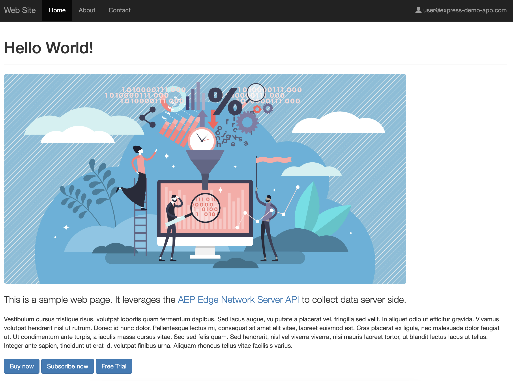
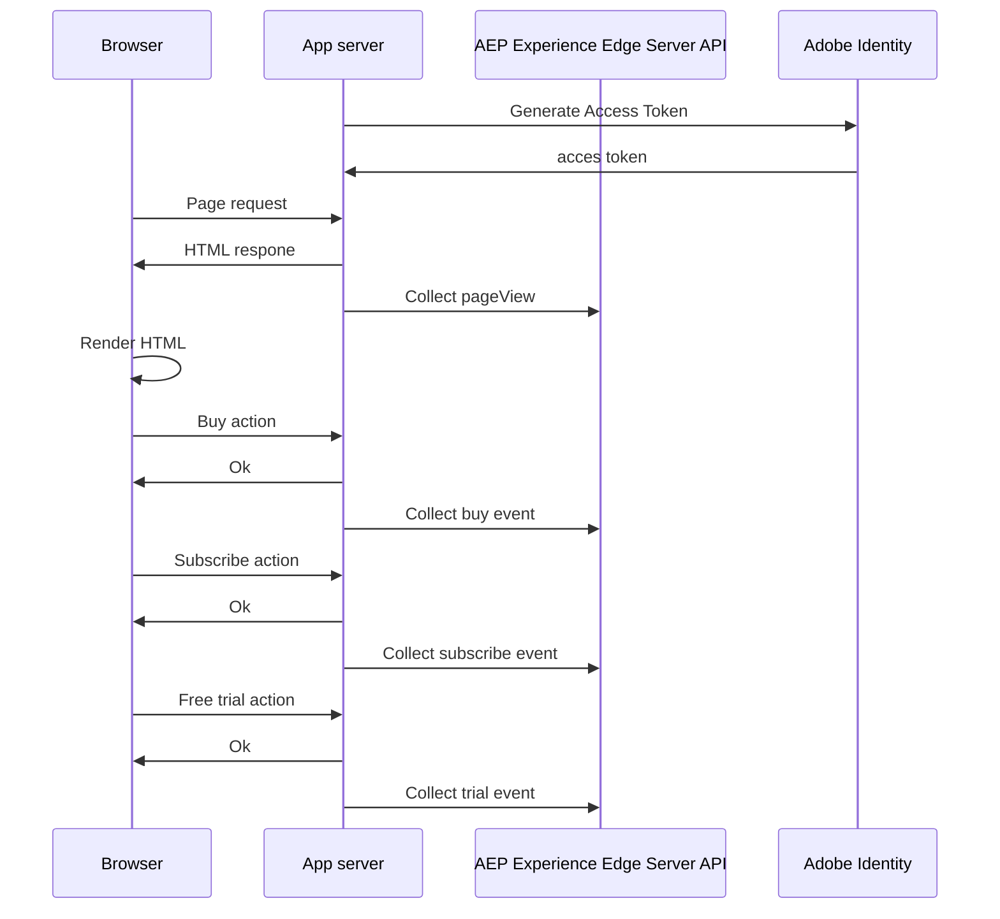

# Server-side Personalization

## Overview

This sample demonstrates how to collect data in Adobe Experience Platform using [Edge Network Server API](https://experienceleague.adobe.com/en/docs/experience-platform/edge-network-server-api/overview).

This sample does NOT rely on client-side libraries like the [Adobe Experience Platform Web SDK](https://experienceleague.adobe.com/docs/experience-platform/edge/home.html) to collect data. 
Instead, it uses the application server to integrate with Adobe Experience Platform and transparently collecting events.

The events that will be collected are:
* `pageView` - automatically collected on each page load
* `buy` / `subscribe` / `trial` - triggered by the user when they click on the respective buttons

Here is how the page looks like:
 
You can refresh the page to see how the `pageView` event is collected on each refresh. 
Or you can interact with the 3 buttons to see how the `buy` / `subscribe` / `trial` events are collected.

## Running the sample

<small>Prerequisite: [install node and npm](https://docs.npmjs.com/downloading-and-installing-node-js-and-npm).</small>

To run this sample:

1. [Setup local SSL certificates for https](../../LocalSSLCertificateSetup.md).
2. Clone the repository to your local machine.
3. Open a terminal and change directory to this sample's folder.
4. Run `npm install`
5. Run `npm start`
6. Open a web browser to [https://localhost](https://localhost)

## How it works

We can observe from the below sequence diagram that the browser has no direct interaction with Adobe Experience Platform.
The interaction is done by the server asynchronously from the browser requests to the server, this way no extra lateny is added to the user experience.

1. [Express](https://expressjs.com/) is used for a lean server-side implementation. To handle basic server requests and routing.
1. The communication with the Server API is authenticated using the [Adobe Identity Management System](https://helpx.adobe.com/enterprise/using/identity.html),
to obtain credentials with which you can generate an access token, you need to follow this [guide](https://experienceleague.adobe.com/en/docs/experience-platform/edge-network-server-api/authentication).
1. You will need to also create a [datastream](https://experienceleague.adobe.com/en/docs/experience-platform/datastreams/configure#aep) and configure it for Adobe Experience Platform, 
by configuring a [Dataset](https://experienceleague.adobe.com/en/docs/experience-platform/catalog/datasets/overview) in which data will be ingested. You can also enabled the Dataset for Profile,
1. All the configurations details obtained in the previous 2 steps, should be added to the `.env` file. An interesting option is `AEP_EDGE_REGION` which should be set to the nearest region  of your deployment. 
You can find available regions [here](https://experienceleague.adobe.com/en/docs/experience-platform/edge-network-server-api/location-hints#location-hints-usage). You can also leave it empty and our geo load balancing will have you covered. 
_Note_: It is important to set the region when doing personalization in order for the user profile to be built in a single region.
1. Now everything is set up and you can start the server with `npm start` and open a browser to [https://localhost](https://localhost). 
If you are looking in your console you should already see a `pageView` event being collected. By clicking the buttons you will see how the other events are collected.
1. Now you can view the collected data inside [Adobe Experience Platform](https://experience.adobe.com/platform). You have a few options to view the data:
   * [Real-time Customer Profile](https://experience.adobe.com/platform/profile/browse) - searching by the Identity included in the events which is `user@express-demo-app.com` of namespace `Email`. _Note_: This option is available only if you enabled your dataset for Profile.
   * [Query Service](https://experience.adobe.com/platform/query/edit) - you can query the data from the dataset
   * [Dataset](https://experience.adobe.com/platform/dataset/browse) - you can preview the ingested batches through the `Preview dataset` option 

## Beyond the sample

This sample app can serve as a starting point for you to experiment and learn more about Adobe Experience Platform.
