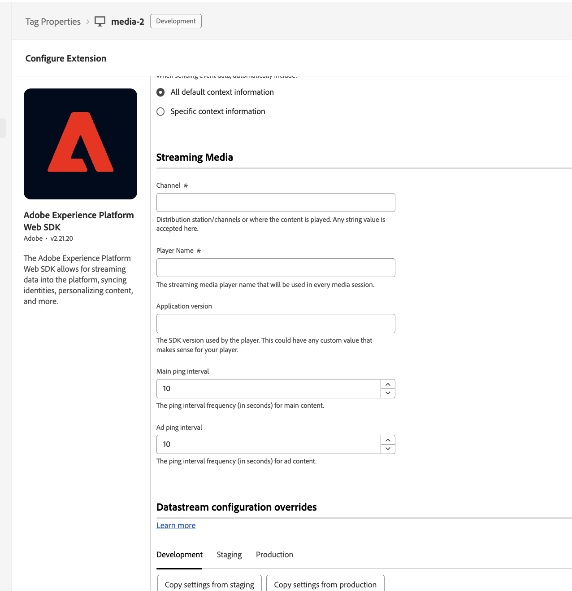
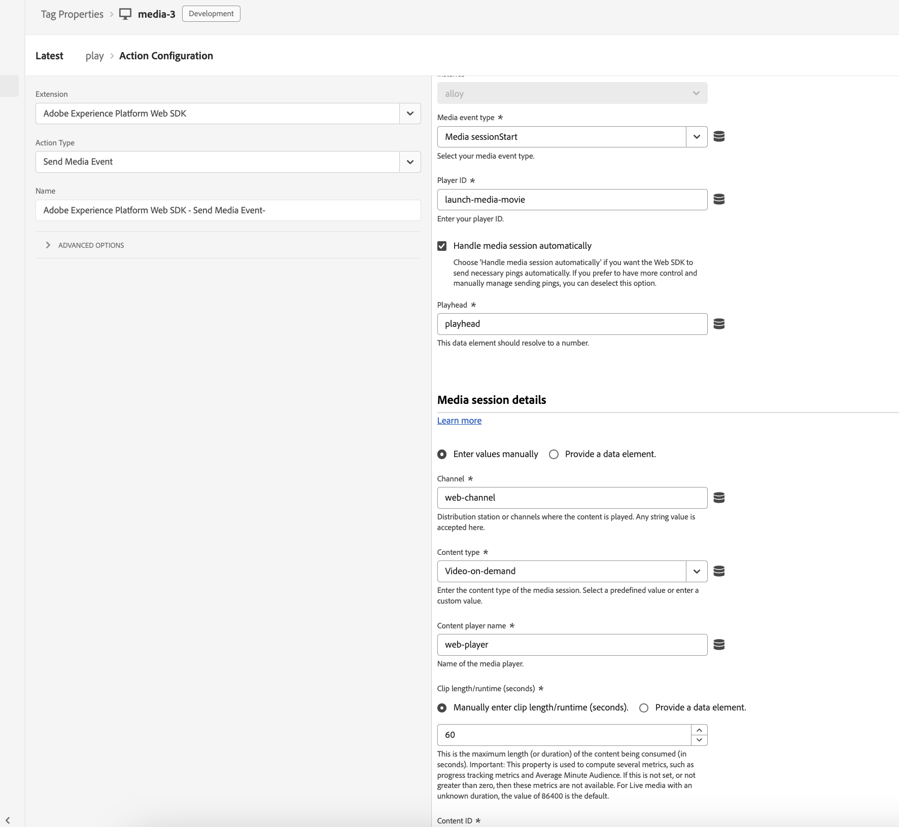
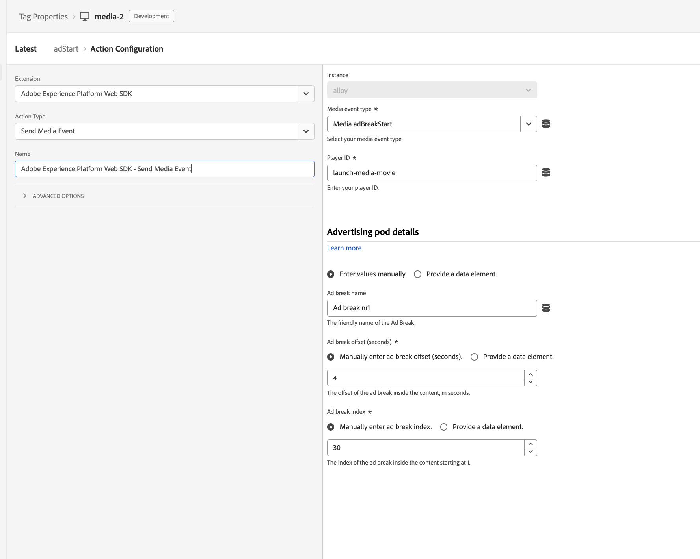

# Overview

Customers that are using Adobe Tags to implement Adobe solutions, can implement Media using Web SDK Tags Extension..

# Configuration

To configure Media, when installing the Web SDK Extension, there is a Media section where settings like `player name`,
`channel` have to be provided.


# Create a session

To create a Media Session, similarly to the standalone library implementation, session details are needed as well as an
alias to that media session, this can be a random string, the element ID of the player.


To receive the session ID, there is an event that triggers once the response from server is returned and has
the sessionID in the `event.sessionId`. It can be stored to a Data Element and reused later using a Custom Code
action provided by Core extension.

Using Custom Code action it can be stored to a Data Element.

```javascript
_satellite.setVar("sessionId", event.sessionId);
```

# Send a Media Event

After a Media Session has been successfully created, following Media Events can be triggered using the `Send Media Event` action.
The action allows to handle it in two modes: automatic and non-automatic mode, which can be enabled
checking `Handle Media Session Automatically`.
Once the `eventType` is selected the appropriate form will be rendered, so that related details are provided to the event.


If more control over the Media Session is needed then the other form should be used by unchecking the `Handle Media Session Automatically` option.


# Migration Strategy

To have a smoother migration it is recommended to use the `Get Media Tracker API`. When configuring the action and an object namee is provided, then
Legacy Media Analytics API will be exported to that window object. If none is provided it will be exported to `window.Media` as curent Media JS library does.


Then using custom code action, the API can be accessed. It has been done this way to ease the migration path,
because the current implementation has a lot of custom code that is harder to change at once.
