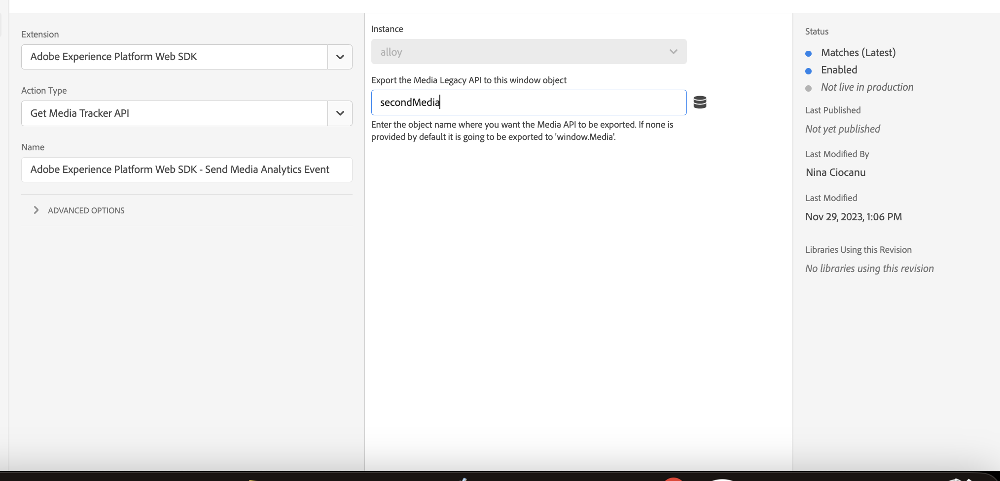

# Overview

Customers that are using Adobe Tags to implement Adobe solutions, can implement Streaming Media using Web SDK Tags Extension.

# Configuration

To configure Media, when installing the Web SDK Extension, there is a Media section where settings like `player name`,
`channel` have to be provided.


# Create a session

To create a Media Session, the `Send Media Event` action should be used. Similarly to the standalone library implementation there are two options:
- handle media session automatically - pings are automatically triggered at the frequency that is set in the configuration
- handle media session manually - pings need to be triggered manually

The player ID is an identifier for the media session, this can be a random string or the element ID of the player.
Session details should be provided when sending a "Session start" event using `Send Media Event` action.
Playhead and QoE data elements should be provided when starting the media session. The following events will inherit the playhead and QoE data from it's session.


# Create a playhead data element
To create a playhead data element, a custom code data element should be used. The custom code should return the current playhead of the player.

```javascript

const player = document.getElementById("launch-media-movie");
return parseInt(player.currentTime, 10);

```
# Create a Quality of Experience data element
To create a Quality of Experience data element, a `Media: Quality of Experience` data element or custom code data element can be used. 
The custom code should return the current Quality of Experience details of the player.


# Send a Media Event
Once the `eventType` is selected the appropriate form will be rendered, so that related details are provided to the event.
`Player ID` is necessary to identify the media session and augment the event with details like `sessionID`, `playhead`, QoE data.


# Migration Strategy

To have a smoother migration it is recommended to use the `Get Media Tracker`. When configuring the action and an object namee is provided, then
Legacy Media Analytics API will be exported to that window object. If none is provided it will be exported to `window.Media` as curent Media JS library does.


Then using custom code action, the API can be accessed. 
