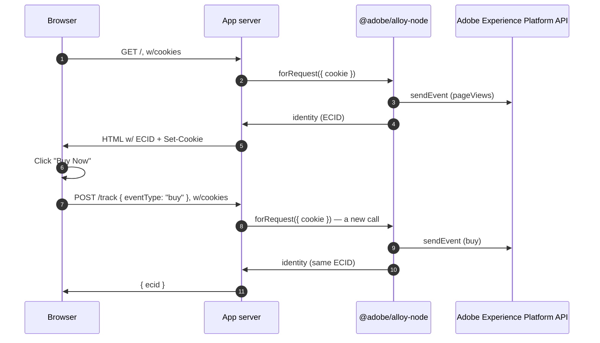

# Node Server-side Data Collection Sample

## Overview

This sample demonstrates server-side analytics/data collection powered by
[`@adobe/alloy-node`](https://github.com/adobe/alloy/tree/main/packages/node),
the Adobe Experience Platform Web SDK's (alpha) Node.js
entrypoint.

Unlike [`data-collection/data-collection-server-side`](../../data-collection/data-collection-server-side)
(which authenticates against a separate, OAuth-based Edge Network *Server*
API using IMS client credentials), this sample uses `@adobe/alloy-node`'s
own `sendEvent()` — the same public interactive collection endpoint the
browser SDK uses, no IMS/OAuth setup required. The interesting part isn't
the API call itself (that's the same `sendEvent()` used everywhere else in
these Node samples) — it's that **identity stays consistent across
completely separate requests**: the page load and every subsequent
button-click request each get their own `forRequest()` call, and all of
them resolve to the same visitor.

## Running the sample

<small>Prerequisite: [install node and npm](https://docs.npmjs.com/downloading-and-installing-node-js-and-npm).</small>

1. In this folder, run `npm install`.
2. Run `npm start`.
3. Open a web browser to <http://localhost:4302>. The page displays this
   visitor's ECID, resolved from the page-load event. Click any of the
   three buttons — each event log entry shows the ECID that request
   resolved to, which should always match the page's.

By default (see `.env`), this sample points at the same shared Alloy test
org/datastream used throughout the `adobe/alloy` repo's own tests. Point
`ORG_ID`/`DATASTREAM_ID` at your own to see the events land in your own
datasets.

## How it works

1. [Express](https://expressjs.com/) handles routing; `cookie-parser`
   exposes the visitor's real cookies on `req.cookies`.
2. `src/server.js` calls `alloy.configure()` **once**, at startup.
3. `GET /` calls `alloy.forRequest({ cookie })`, then
   `request.sendEvent({ xdm: { eventType: "web.webpagedetails.pageViews" } })`
   to record the page view, then `request.getIdentity()` to resolve and
   display this visitor's ECID.
4. Each button (`public/script.js`) does a `fetch("POST", "/track", ...)`
   with an `eventType`. That route calls `alloy.forRequest({ cookie })`
   **again** — a brand new request-scoped handle, with no server-side
   session state shared with step 3 — reads `req.cookies` from *this*
   request, and calls `sendEvent()`/`getIdentity()` the same way.
5. Because both requests read the same visitor's real `kndctr_`/`AMCV_`
   cookies, they resolve to the same ECID — which the page displays
   alongside each collected event, so you can see it match live.

### Flow diagram

## Key observations

### This is the same `forRequest()`/`sendEvent()` as every other Node sample

There's nothing collection-specific about the mechanism here — it's the
identical pattern used by
[`node/personalization-hybrid`](../personalization-hybrid) and
[`node/personalization-server-side`](../personalization-server-side) to
fetch decisions. `sendEvent()` doesn't care whether you're asking for
personalization or just recording an event; what matters for either is
that the *same visitor's* requests all get a `forRequest()` call backed by
that visitor's real cookies.

### No shared server-side state between requests

Nothing about "this is the same visitor as the page load" is cached on the
server between the `GET /` and `POST /track` calls — there's no session
store, no in-memory map keyed by visitor. Continuity comes entirely from
the visitor's own cookies being read fresh on every request, the same way
it would across two separate page loads in a browser.
