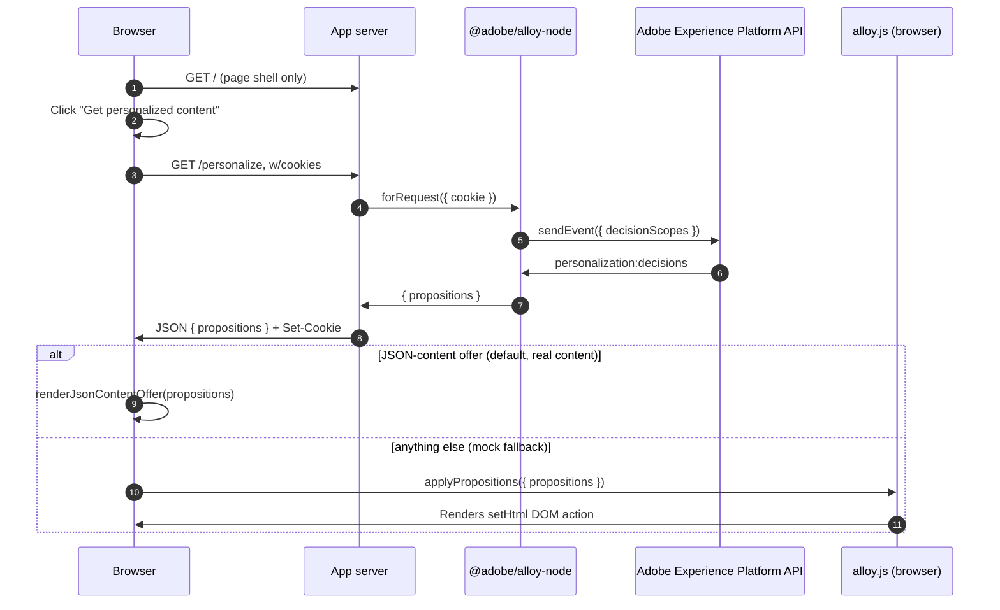

# Node Hybrid Personalization Sample

## Overview

This sample demonstrates hybrid personalization powered by
[`@adobe/alloy-node`](https://github.com/adobe/alloy/tree/main/packages/node),
the Adobe Experience Platform Web SDK's (alpha) Node.js
entrypoint — as opposed to
[`target/personalization-hybrid`](../../target/personalization-hybrid) and
[`ajo/personalization-hybrid`](../../ajo/personalization-hybrid), which make
raw REST calls to the Edge Network with no SDK involved.

Clicking the "Get personalized content" button on the page calls a
`/personalize` endpoint, which asks the server to call `sendEvent()`
requesting personalization decisions right then. The client only renders
whatever the server hands back, via the browser SDK's `applyPropositions`
command — no separate server-to-client cookie plumbing is needed, because
`@adobe/alloy-node`'s `forRequest()` reads and writes this visitor's
identity directly from/to the real request/response cookies.

## Running the sample

<small>Prerequisite: [install node and npm](https://docs.npmjs.com/downloading-and-installing-node-js-and-npm).</small>

1. In this folder, run `npm install`.
2. Run `npm start`.
3. Open a web browser to <http://localhost:4300> and click "Get
   personalized content".

By default (see `.env`), this sample points at the same org, datastream,
and decision scope (`sample-json-offer`) as this repo's own
[`target/personalization-hybrid`](../../target/personalization-hybrid)
sample — a real Target activity its maintainers keep live for exactly this
kind of demo. So the very first click already returns genuine personalized
content, not the mock fallback; see below if you want to point it at your
own org/activity instead.

## Using real personalization content

This sample already points at a live Target activity by default (see above).
If you want to see your *own* org's personalization instead:

1. You'll need an Adobe Experience Platform sandbox with a datastream that
   has **either** Target **or** Journey Optimizer decisioning connected.
2. Author and publish/activate an activity (Target) or experience (Journey
   Optimizer) that points at your mbox or surface.
3. Restart the server (`npm start`) and click the button again. The page
   should show a green "live content" banner.

## How it works

1. [Express](https://expressjs.com/) handles routing; `cookie-parser`
   exposes the visitor's real cookies on `req.cookies`.
2. `src/server.js` calls `alloy.configure()` **once**, at startup — the
   config (org, datastream, ...) never changes per request.
3. `GET /` just renders the page shell — no personalization request has
   happened yet.
4. Clicking the button calls `GET /personalize` (`public/script.js`). That
   route calls `alloy.forRequest({ cookie })`, binding a request-scoped
   handle backed by an adapter over *this* request's real cookies
   (`createExpressCookieService`), so identity is read from and written to
   the visitor's actual `Cookie`/`Set-Cookie` headers rather than any
   in-memory or shared state.
5. `request.sendEvent({ decisionScopes: [...] })` sends a real request to
   the Edge Network and returns `{ propositions }` — the same shape
   `applyPropositions` expects. The route returns that (or the mock
   fallback) as JSON, alongside any `Set-Cookie` headers the cookie adapter
   wrote.
6. Client-side, the real browser `alloy.js` (loaded from Adobe's CDN)
   renders whatever came back: JSON-content offers (the default,
   real-content case) are rendered by `renderJsonContentOffer` reading
   `items[0].data.content` directly; anything else (the mock fallback's
   `dom-action` proposition) goes through
   `alloy("applyPropositions", { propositions })`, which renders the
   `setHtml` DOM action into `#personalization-target` with no custom
   rendering code needed at all.

### Flow diagram

## Key observations

### Cookies

Unlike the raw-REST hybrid samples, there's no manual cookie-plumbing code
tying the server and client together (compare to `common/cookies.js`) —
`forRequest`'s `cookie` override reads `req.cookies` and writes a
`Set-Cookie` header directly, so identity naturally persists across
requests from the same visitor the same way it would in the browser.

### `sendEvent()` vs `applyPropositions()`

The `/personalize` call requests decisions only
(`decisioning.propositionFetch`) — it does not send a display notification.
Once the client calls `applyPropositions`, that's the point at which a real
implementation would want to track that the content was actually shown; see
the [`target/personalization-hybrid`](../../target/personalization-hybrid)
sample's `sendDisplayEvent` for the pattern (not yet wired up in this Node
sample).
