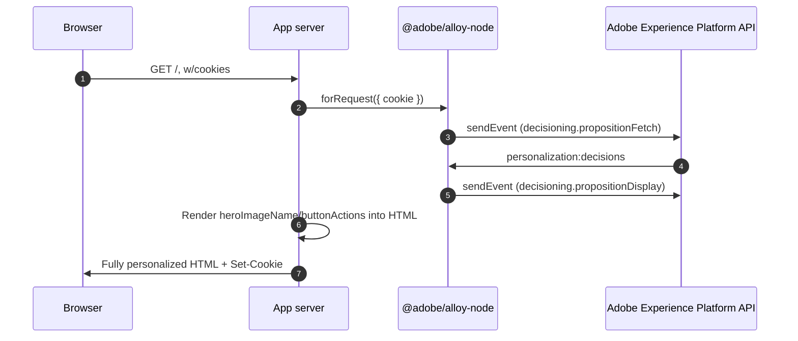

# Node Server-side Personalization Sample

## Overview

This sample demonstrates server-side personalization powered by
[`@adobe/alloy-node`](https://github.com/adobe/alloy/tree/main/packages/node),
the Adobe Experience Platform Web SDK's (alpha) Node.js
entrypoint — as opposed to
[`target/personalization-server-side`](../../target/personalization-server-side)
and
[`ajo/personalization-server-side`](../../ajo/personalization-server-side),
which make raw REST calls to the Edge Network with no SDK involved.

Unlike [`node/personalization-hybrid`](../personalization-hybrid) (which
sends the client raw propositions to render via `applyPropositions`), this
sample renders the personalized HTML **entirely server-side**. The browser
never loads `alloy.js` and never makes a personalization request of its
own — it just receives a fully-formed, already-personalized page.

By default (see `.env`), this sample points at the same real, live Target
activity ("alloy-samples sample-json-offer") as
[`node/personalization-hybrid`](../personalization-hybrid) and
[`target/personalization-hybrid`](../../target/personalization-hybrid), so
the very first load already shows genuine content.

## Running the sample

<small>Prerequisite: [install node and npm](https://docs.npmjs.com/downloading-and-installing-node-js-and-npm).</small>

1. In this folder, run `npm install`.
2. Run `npm start`.
3. Open a web browser to <http://localhost:4301>.

To use your own org's content instead, see
[`node/personalization-hybrid`'s README](../personalization-hybrid/README.md#using-real-personalization-content)
— the same `.env` variables and AEP setup steps apply here.

## How it works

1. [Express](https://expressjs.com/) handles routing; `cookie-parser`
   exposes the visitor's real cookies on `req.cookies`.
2. `src/server.js` calls `alloy.configure()` **once**, at startup.
3. On every `GET /`, `alloy.forRequest({ cookie })` binds a request-scoped
   handle backed by an adapter over *this* request's real cookies
   (`createExpressCookieService`), so identity is read from and written to
   the visitor's actual `Cookie`/`Set-Cookie` headers.
4. `request.sendEvent({ decisionScopes: [...] })` sends a real request to
   the Edge Network and returns `{ propositions }`.
5. If a real proposition came back, the server immediately sends a
   **second** `sendEvent()` call reporting `decisioning.propositionDisplay`
   — since there's no client-side `alloy.js` here to do that once content
   renders, the server is the only thing that can report it was shown.
   Both calls share the same resolved identity (confirmed via
   `packages/node/test/integration/nodeConsumer.spec.js`'s coverage of
   multiple `sendEvent()`/`getIdentity()` calls on one `forRequest()`
   handle) — it isn't re-resolved or re-minted between them.
6. The offer's `heroImageName`/`buttonActions` content is read directly out
   of the proposition and passed straight into the Handlebars template — no
   `applyPropositions`, no DOM actions, no client-side rendering step at
   all. If no live activity is configured, mock content fills the same
   template slots.
7. The response includes any `Set-Cookie` headers the cookie adapter wrote,
   so a second request from the same visitor resolves the same identity
   without minting a new one.

### Flow diagram

## Key observations

### No client-side SDK at all

Compare this to [`node/personalization-hybrid`](../personalization-hybrid):
that sample still loads `alloy.js` in the browser to call
`applyPropositions`. This sample loads nothing — the tradeoff is that the
server must do everything a client-side SDK would otherwise handle for
you, including reporting the display notification (step 5 above).

### Cookies

Same approach as `node/personalization-hybrid`: `forRequest`'s `cookie`
override reads `req.cookies` and writes a `Set-Cookie` header directly
(see `createExpressCookieService`/`serializeSetCookie` in `src/server.js`),
including working around Express's `res.cookie()` rejecting Alloy's legacy
`AMCV_...@AdobeOrg` cookie name (it contains `@`, which every real browser
accepts but the strict `cookie` package used by `res.cookie()` doesn't).
